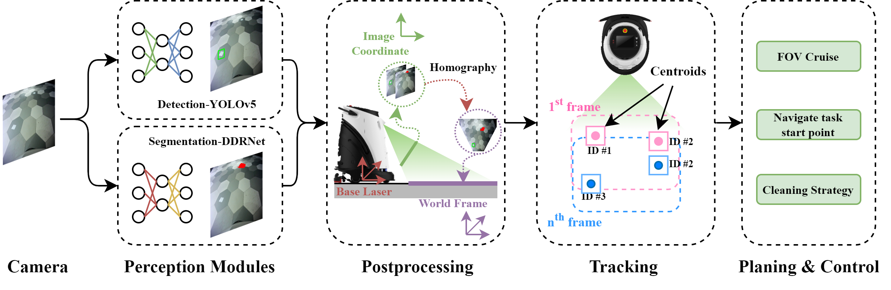
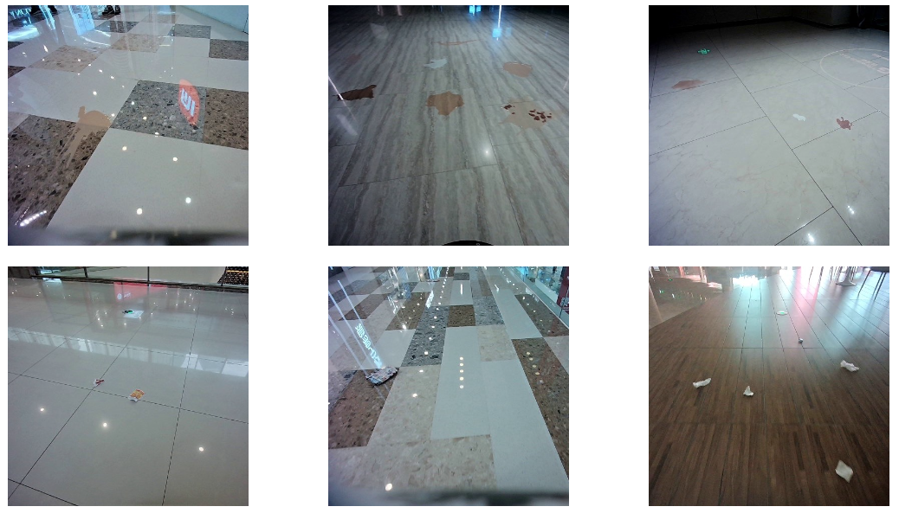

# A Deep-Learning-based System for Indoor Active Cleaning (IROS 2022)
### [Project Page](https://gaussianopensource.github.io/projects/active_cleaning/) | [Paper](https://gaussianopensource.github.io/projects/active_cleaning/files/IROS_2022_GS.pdf)
Dataset and evaluation code our IROS 2022 paper.<br>

A Deep-Learning-based System for Indoor Active Cleaning](https://gaussianopensource.github.io/projects/active_cleaning/) <br>

[Yike Yun](https://scholar.google.com.sg/citations?user=gCQdrmUAAAAJ&hl=zh-CN)\*<sup>1</sup>, Linejie Hou, [Zijian Feng](https://vincentfung13.github.io/)\*<sup>1</sup>, Wei Jin, Yang Liu, Heng Wang,  Ruonan He, Weitao Guo, Bo Han, [Baoxing Qin](https://scholar.google.com.sg/citations?user=07p-bmYAAAAJ&hl=en), [Jiaxin Li](https://www.jiaxinli.me/)<br>
 <sup>1</sup>Gaussian Robotics  
  \*denotes equal contribution

We propose an active-cleaning framework by utilizing deep-learning methods for both solid wastes detection and liquid stains segmentation. Our system consists of 4 components: a Perception module integrated with deep-learning models, a Post-processing module for projection, a Tracking module for map localization, and a Planning and Control module for cleaning strategies. Compared with classic approaches, our vision-based system significantly improves cleaning efficiency. Besides, we released the largest real-world indoor hybrid dirt cleaning dataset (HD10K) containing 10K labeled images, together with a track-level evaluation metric for better cleaning performance measurement. The proposed deep-learning based system is verified with extensive experiments on our dataset, and deployed to Gaussian Robotics's robots operating globally.



## HD10K Dataset

### Dataset Overview

HD10K is the largest indoor real-life dirt dataset to date for cleaning robotics. Common dirt in shopping malls such as flyers/ tickets, and coffee/tea stains are targeted as solid wastes and liquid stains correspondingly. To ensure the variety of our data, we collected our dataset in 3 different Chinese cities. We use our robot's front RGB camera to record the data, during collection, dirt are randomly placed on the floor mimicking the real-life scenes and the robot was manually pushed using random routines. The collected data are in the form of video sequences in 10FPS; key-frames are extracted for annotation by thresholding frame similarity at 2Hz. Bounding boxes and segmentation masks are applied accordingly for solid wastes and liquid stains. Only key-frames are labeled for training data while the entire sequence is labeled for testing data.



### Dataset Statistics

For training, 2 scenes are included each with 2000 extracted key-frames, while 2 video sequences with 1000 frames each are provided for testing. For training data, solid wastes and liquid stains are separately collected and labeled, while for testing data, all dirt are collected and annotated together.

| Split             | Training    | Testing     |
| ----------------- | ----------- | ----------- |
| **Solid Wastes**  | **Scene 0** | **Scene 1** |
| Image             | 2,000       | 2,000       |
| Annotations       | 2,625       | 3,691       |
| **Liquid Stains** | **Scene 0** | **Scene 1** |
| Image             | 2,000       | 2,000       |
| Annotations       | 854         | 2,996       |

Our dataset is not only the largest in the field compared with other benchmark datasets, but also covers the most comprehensive scenarios with both segmentation masks and bounding boxes presented. In total, our dataset consists of 10,000 images with 10,118 bounding boxes and 6,694 polygons for solid wastes and liquid stains, respectively.

### Dataset Usage


## Evaluation Protocol


## Citation

If you find our work helpful to your research, please cite our paper:
```
@inproceedings{dl_active_cleaning_iros,
  title={A Deep-Learning-based System for Indoor Active Cleaning},
  author={Yike Yun and Linjie Hou and Zijian Feng and Wei Jin and Yang Liu and Heng Wang and Ruonan He and Weitao Guo and Bo Han and Baoxing Qin and Jiaxin Li},
  year={2022},
  booktitle={IEEE/RSJ International Conference on Robots and Systems},
}
```